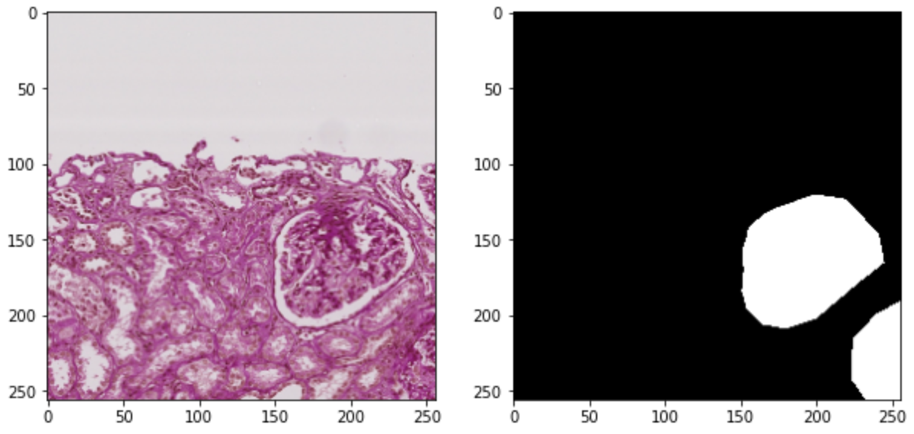

# HuBMAP - Hacking the Kidney
The challenge is to detect functional tissue units (FTUs) across different tissue preparation pipelines. An FTU is defined as a “three-dimensional block of cells centered around a capillary, such that each cell in this block is within diffusion distance from any other cell in the same block”. For this you will be given a high-resolution tif file and a corresponding mask file which contains the masks for the FTUs.

## **Dataset source and Resources**
 * Dataset - [Here](https://www.kaggle.com/wrrosa/hubmap-tfrecords-1024-256?select=train2)
 * In-Depth EDA - [HuBMAP - Exploratory Data Analysis](https://www.kaggle.com/ihelon/hubmap-exploratory-data-analysis) by - [@Yaroslav Isaienkov](https://www.kaggle.com/ihelon)
 * **Note**: The credit for majority of code goes to [@Wojtek Rosa](https://www.kaggle.com/wrrosa) whose [notebook](https://www.kaggle.com/wrrosa/hubmap-tf-with-tpu-efficientunet-512x512-train) I have forked for my experiments.

## **Sample Image**
The below image is a patch of size `1024x1024` reduced to `256x256` from the original image and a corresponding binary mask.

## **Results of Experiments**
I performed several experiments which manily very on the `loss`, `backbone model` and `architecture`. Below is the summary of my experiments.

**Note**: All the results are averaged over a 5Fold Cross Validation.
BackBone | Architecture | Loss Type | Loss Value | Dice Score | IOU score
---------|--------------|-----------|------------|------------|---------
EfficientNetB0 | UNET | BCE | 0.0291 | 0.8991 | -
EfficientNetB0 | FPN | BCE_dice_loss | 0.128 | 0.9044 | 0.82074
EfficientNetB0 | PSNET | BCE_dice_loss | 0.2341 | 0.8156 | 0.69116
EfficientNetB7 | UNET | BCE_dice_loss | 0.17286 | 0.90578 | 0.78348
EfficientNetB7 | FPN | BCE_dice_loss | 0.16392 | 0.917 | 0.79638

The weights of the `UNET` with `EfficientNetB7` backend can be downloaded from [here](https://drive.google.com/file/d/12NG4kOE-y9JAzZNojwDe8nV6t3VFfV_b/view?usp=sharing).

Sadly the weights of `FPN` with `EFficientNetB7` backend were not saved due to runtime disconnection. Also, for the `UNET` with `EfficientNetB0` backend I forgot to compute `IOU` as initial I just planned to focus on `dice` but for that later models I included that as well.

**Further Enhancements:**
 * Use different loss Functions
 * Use other architecutes for backends
 * More augmentations
 * Work on different resolutions

As Machine Learning is a iterative process and hence never ends I will conclude my experiments at this point.