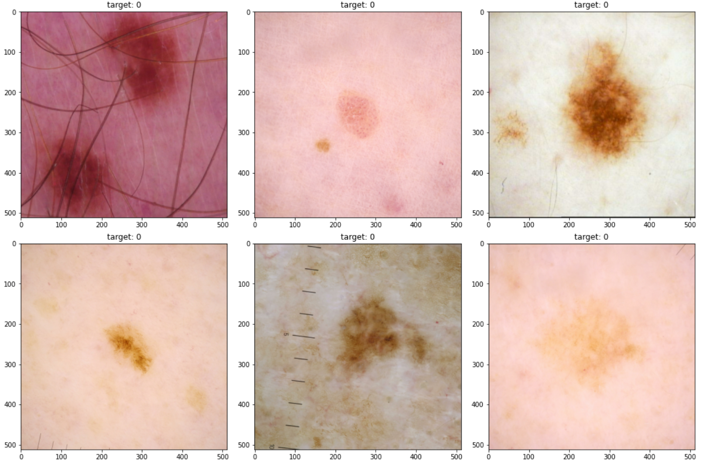

# Melanoma Classification

**Objective** - Given a image of a spot on skin the aim is to identify whether it is melignant or not.

The Dataset of case be obtained from [here](https://www.kaggle.com/c/siim-isic-melanoma-classification/data)

### Sample Image:

**The problem was very hard due to highly imbalanced dataset**

### Results:
Model | LOSS | AUC | VALIDATION LOSS | VALIDATION AUC 
------|--------|--------|--------|----------------
EfficientNetB7 | 0.0747 | 0.8300 | 0.0703 | 0.8666 

**Note**: By mistake I deleted the logs of other models but the EfficientNetB7 was performing the best in my experiments.