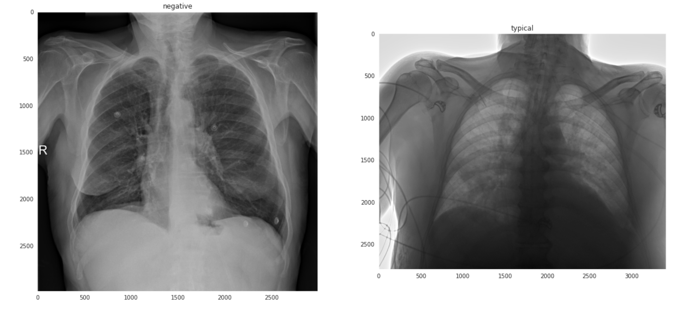

# SIIM-FISABIO-RSNA COVID-19 Detection

In this problem you are provided with a study over a patient and you have to identify if that study is abnormal or not. In each study there are several dicom files of the patient and each file contains a pixel array which contains the image of the chest and lungs which radiologists use to identify.
Also Given each image you have to do object-detection and create a bounding box over the area of abnoramlity if the abnormality exists. Below are 2 sample images from the dataset.

**The Dataset can be downloaded from <a href='https://www.kaggle.com/xhlulu/siim-covid19-resized-to-512px-png'>here</a> There were total 6334 images.**

**The Pretraining of the EfficientNet was done on the <a href='https://www.kaggle.com/xhlulu/vinbigdata-chest-xray-resized-png-1024x1024'>this</a> dataset.

The problem was very challanging as there were really few positive samples which is usually the case with medical images. To hande it I used various techniques such as **`Pre-Training`** the classifier on a similar dataset. **`Augmentation`** and last but not least **`Loss-Weight-Adjustment`**.

For the following problem I created the gigantic model of **`EfficientNetB7`** and trained over a `tpu` on kaggle.
The results are averaged over a `5-fold` cross-validation.
train loss | train AUC | valid loss | valid AUC  
----|------ |------ |------
0.391 | 0.8392 | 0.3909 | 0.7951

For the purpose of object-detection I trained a **`YOLOv5`** Model which provided the following results on the valid set.
Precision | Recall | mAP@0.5 | box Loss | cls loss | obj loss | Epochs
----------|--------|---------|----------|----------|----------|-------
0.5084    | 0.5239 | 0.4715  | 0.05213  | 0.00006  |  0.01047 | 24 

The resuls of the `Yolov5` can be seen <a href="https://wandb.ai/abhishek_prajapat/Kaggle-SIIM-YOLOv5?workspace=user-abhishek_prajapat">here</a>. These contains results of my multiple runs.

I also studied other models and their performance on the same problem but these models were performing the best respectively.